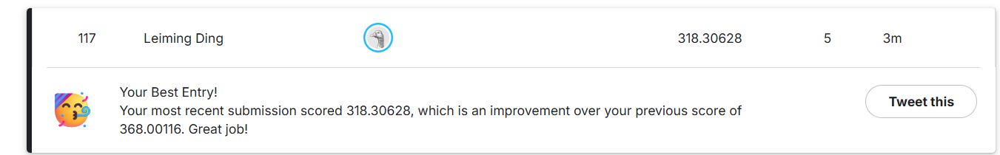

# **Using DCGAN to Generate Monet-style Images**

## **Problem description**
Artists often have their own strong unique features when creating their artworks. If we can extract these features from their work, we can generate many artworks in those artists' style. The purpose of this project is to extract features from Monet photos and then use GAN to apply these features into new photos and create Monet-style images.

## **Data description**
There are four subfolders provided: 'monet_jpg', 'monet_tfrec', 'photo_jpg', 'photo_tfrec'. For this project, I will focus on 'monet_jpg' and 'photo_jpg'.
- monet_jpg: 300 images
- photo_jpg: 7038 images

## **Exploratory data analysis**
I first calculate how many observations are in each dataset. Then, I visualized some random images from the two dataset I focused on. From monet paintings, we can see bright lights and colors in objects and landscapes. We can also see the brushstrokes. From the photos, we can see that these photos are about similar objects and landcapes and more clear than paintings. But when we see those photos, we know they do not represent Monet styles.

## **Model architecture**
DCGAN consist of two competing models—a generator that learns to create realistic images from random noise, and a discriminator that learns to differentiate real images from generated ones. This DCGAN operates on 64×64 RGB images. The generator transforms a 100-dimensional noise vector into an image through five transposed convolution layers, gradually expanding from 4×4 to 64×64. Each layer uses BatchNorm and ReLU, and the final output applies Tanh to match normalized pixel values. The discriminator mirrors this structure using downsampling convolutions with LeakyReLU and BatchNorm, compressing a 64×64 image to a single authenticity logit. Both networks follow standard DCGAN weight initialization (N(0,0.02)), and images are resized, normalized, and loaded. For the generated images, we resized to 256x256 for submission.

## **Hyperparameter tuning**
The model uses a latent dimension of 100, batch size of 128, and 150 training epochs. We adjusted several hyperparameters, including loss function, learning rate and epochs, to improve stability. Instead of the standard BCE loss, I applied MSELoss (LSGAN-style) to produce smoother gradients and reduce training oscillation. The learning rate was also tuned. 

## **Analysis and result**
I tried different combinations of hyperparamters and I finally chose MSE, 1e-4, and 150 epochs as the model to generate images base on FID (the smaller, the better).
|Run	|loss	|Learning Rate |	Epochs |	FID |
|-----|------|-------------|---------|------|
|A	|MSE	|1e-4	|150	|280.82|
|B	|BCE	|2e-4	|150	|284.43|
|C	|MSE	|2e-4	|200	|337.84|

## **Learning and Takeways**
- Generally speaking, if you choose higher epochs, more features will show up and the images become clearer.
- Loss function: MSE can outperform BCE perhaps because MSE keeps penalizing the distance between D(fake) and the target (e.g., 1) in a more linear way, so the generator still gets useful gradients even when D is strong.
- Learning rate: for 1e-4, updates are smaller and more stable; GANs are very sensitive to learning rates.

## **Ways to improve**
- It would be better to have complete plan for hyperparameter tuning beyond learning rate, loss function, epochs.
- If GPU resources allow, try more epochs.

## **Competition result**

